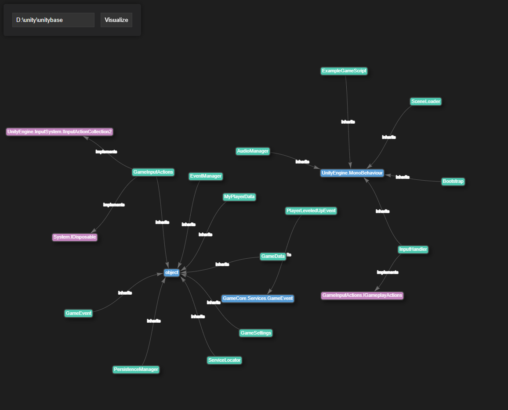

# Sharp Analyzer

A class hierarchy and reference visualizer for C# ASP.NET Core projects using Roslyn.

## 🔍 What it does

Analyzes an ASP.NET or .NET project and generates a visual graph of its classes, interfaces, and references using Vis.js.

## 🖼 Example



## 🚀 Getting Started

### Prerequisites

- [.NET 6 SDK or later](https://dotnet.microsoft.com/download)

### Install & Run

Clone the repo:

```bash
git clone https://github.com/FUZASHI/sharp-analyzer.git
cd sharp-analyzer
dotnet restore
dotnet run
